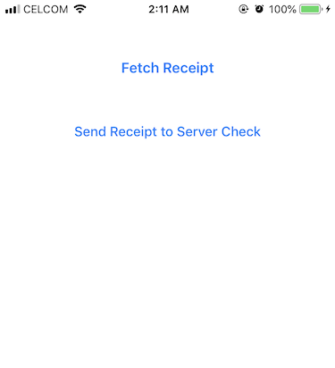
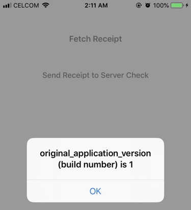

# Receipt Check app (with server)

Demo app to demonstrate how to send 64-base encoded receipt data to server.

Change the **bundle identifier** to match your app identifier.

Change the **receipt_server_url** with your server url.

